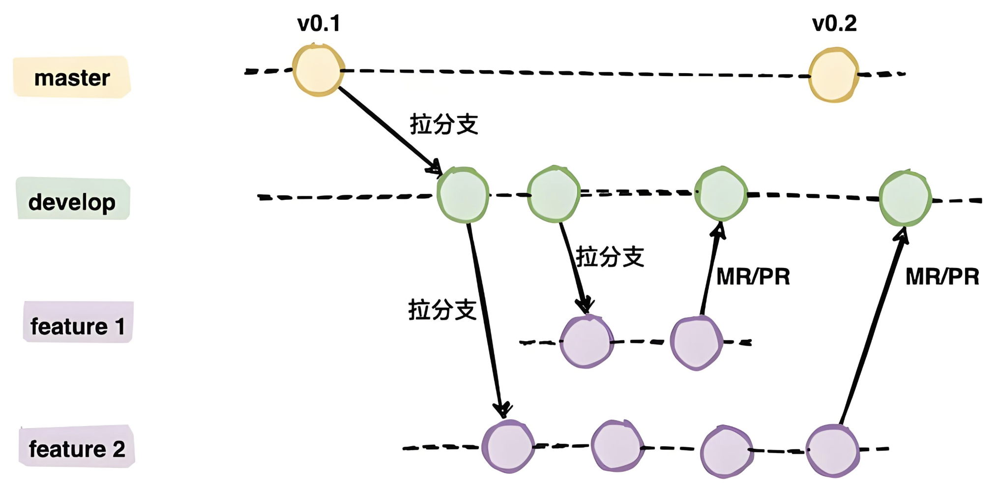

> 同步至【金山文档 | WPS云文档】 CampusWorkGuard开发规范
> https://www.kdocs.cn/l/cbTMm8hiP7SY
## 一. Git规范
1. 开发应在`develop`分支进行，开发好一个`feature`后进行`code review`，提`merge request`，合并到`develop`上。
2. 需要上线的时候将`QA`测试好的代码分支（目前为`develop`分支，后续会按需添加`test`分支等）合并到`main/master`分支，并打上`Tag`，发布为`release`，通过`CI/CD`流水线发版。
3. 代码分支流

4. 想要对代码进行修改，需要将最新版`develop分支`代码拉下来，然后签出分支，命名规范为`操作/具体工作/姓名`，例如：feature/user_login/hanlelin，这里的feature可以按需换成test/refactor/fix等。
5. 提交`commit msg`应为：feat: xxxx（feat后为英文冒号，后空一个空格，其中feat操作可以换成其他的操作，如fix/test/refactor等）
6. merge要求：如果当前开发分支签出时候的develop已经落后于目前的develop分支，应**先在本地更新develop**，然后将`develop`自己`merge`到自己新开发的分支，然后再提mr，以确保更新基线。

